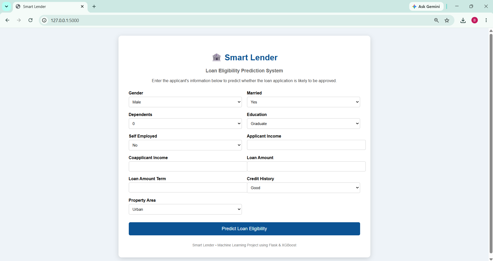
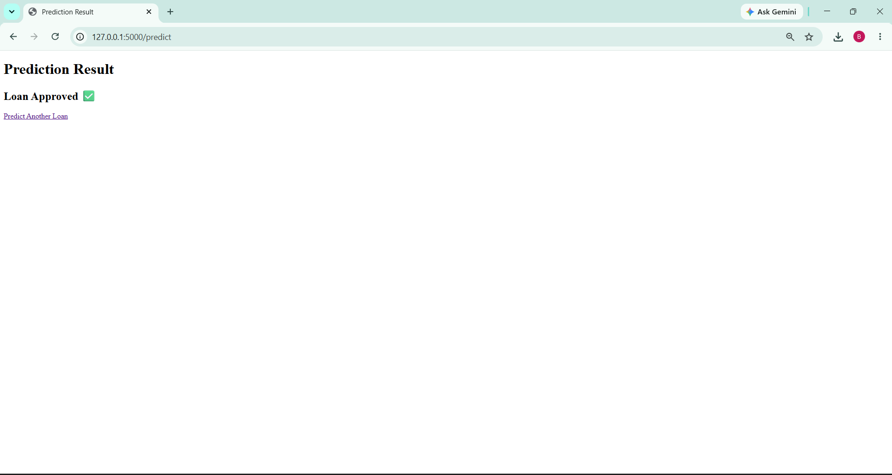
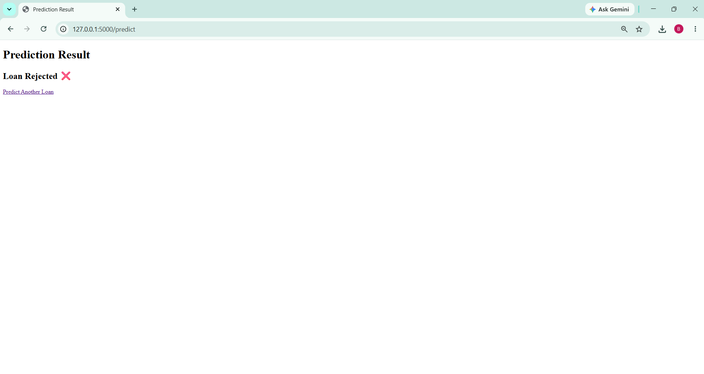

# 🏦 Smart Lender - Loan Eligibility Prediction System

## 📌 Project Overview

Smart Lender is a Machine Learning-powered web application that predicts whether a loan applicant is eligible for a loan. The application helps banks and financial institutions make faster, data-driven decisions using classification algorithms.

The project uses Python, Flask, Scikit-learn, and XGBoost to train models and provide real-time predictions through a web interface.

---

## 🚀 Features

- Loan eligibility prediction
- User-friendly Flask web application
- Data preprocessing and feature engineering
- Exploratory Data Analysis (EDA)
- Multiple machine learning models
- Real-time prediction

---

## 🛠 Technologies Used

- Python
- Flask
- Pandas
- NumPy
- Matplotlib
- Seaborn
- Scikit-learn
- XGBoost
- HTML
- CSS
- Git & GitHub

---

## 🤖 Machine Learning Models

- Decision Tree
- Random Forest
- K-Nearest Neighbors (KNN)
- XGBoost

---

## 📊 Model Performance

| Model | Training Accuracy | Testing Accuracy |
|--------|------------------:|-----------------:|
| Decision Tree | 100.00% | 69.92% |
| Random Forest | 100.00% | **77.24%** |
| KNN | 73.73% | 58.54% |
| XGBoost | 100.00% | 75.61% |

---

## 📂 Project Structure

```text
Smart-Lender-Loan-Eligibility-Prediction
│
├── app.py
├── train_model.py
├── README.md
├── requirements.txt
│
├── dataset
├── models
├── notebooks
├── static
└── templates
```

---

## ⚙️ Installation

Clone the repository:

```bash
git clone https://github.com/chennubhargavi05/Smart-Lender-Loan-Eligibility-Prediction.git
```

Install dependencies:

```bash
pip install -r requirements.txt
```

Run the application:

```bash
python app.py
```

Open your browser and visit:

```
http://127.0.0.1:5000
```

---

## 📷 Screenshots

### Home Page



### Loan Approved



### Loan Rejected



## 🎯 Future Enhancements

- User authentication
- Loan risk score
- Cloud deployment
- Database integration
- Improved model tuning
- Dashboard for bank officers

---

## 👩‍💻 Author

**Bhargavi Chennu**

GitHub: https://github.com/chennubhargavi05